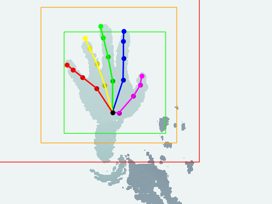

# Hand detection and tracking

> Experimental hand detection and tracking from single depth camera.

<span style="display:block;text-align:center"></span>

Note: this is a two-week quick patch following the [hand pose estimation project](https://github.com/xkunwu/depth-hand) located in the main repo.
The purpose is to make live capture and hand tracking possible, but currently no plan to make the code waterproof (might be a future research project).

## Hardware prerequisite
The code was tested using SR300 and D400 series (D415/D435).
Please follow the [official instructions](https://github.com/IntelRealSense/librealsense/blob/master/doc/distribution_linux.md) to install necessary drivers.

Note: the code was updated to use [Intel® RealSense™ SDK 2.0](https://github.com/IntelRealSense/librealsense), so the minimum supported camera model is SR300.

Also note: SR300 should work nicely after installing the drivers (hit 'realsense_viewer' to test if anything went wrong). But for D400 series, additional firmware update is necessary: go to the [official site](https://downloadcenter.intel.com/download/28377/Latest-Firmware-for-Intel-RealSense-D400-Product-Family?v=t) and following instructions there ('realsense_viewer' will also find any firmware issues and show you the latest update link).

## Usage
Default is using the 'super_edt2m' model.
Please check the main repo for [finding the full list of models](../README.md#print-model-list).

Note: tracking code does not require the prepared data, only need to download your favorite pretrained model. See [README.md in the pose estimation part](../README.md#pretrained-models) for more details.
```
cd depth-hand/code
python -m camera.capture --model_name=super_edt2m
```
-   If you want to see more debug information:
    ```
    python -m camera.capture --model_name=super_edt2m --show_debug=True
    ```
-   Save detection results:
    ```
    python -m camera.capture --model_name=super_edt2m --save_det=True
    ```
-   Save raw stream data (for replay and test):
    ```
    python -m camera.capture --model_name=super_edt2m --save_stream=True --save_det=True
    ```
    NOTE: previous data will be overwritten!
-   Read saved raw stream data (instead of live capture):
    ```
    python -m camera.capture --model_name=super_edt2m --read_stream=True --save_det=True
    ```

## Assumptions
-   single hand
-   hand is the closest to the camera
-   no other objects within 'crop_range', default: 100mm-480mm
-   pre-trained model was targeted at left hand

### Design flavors
Here 'detection' means finding the axis-aligned bounding cube (AABC) that can crop the part of hand data out.
The algorithm use the same fixed side length as training part (default: 240mm, so sorry for testers with huge hand :pensive:).
So the problem is reduced to find the center of that detection AABC.

The difficulties comes from the noise and outlier issue inherent to the depth camera - it's very often to see sudden jump between streaming frames, which leads to false detection.
That's why I have provided a [long list of assumptions in the previous section](#Assumptions), which can make life much easier.

#### Data denoise
This is for making hand detection more stable. Currently I am using [Bilateral filtering](http://homepages.inf.ed.ac.uk/rbf/CVonline/LOCAL_COPIES/MANDUCHI1/Bilateral_Filtering.html).
BTW, outlier remover seems not very necessary, at least my SR300 works fine (nice job Intel).

#### Momentum stabilizer
Note: the name of this idea popped into my head randomly - not referring to any specific terminology.

If the distance $d_{01}$ between current detection $c_1$ and previous detection $c_0$ is larger than default threshold $\lambda = 120mm$, then the algorithm will just drop current detection.
Otherwise, linear interpolation $c_0 * (1 - p) + c_1 * p$ is calculated as the detection for current frame.
Here $p$ represents the confidence of current detection, which is inverse proportional to the distance $d_{01}$: $p = exp(- \alpha * d_{01}^2)$, where $\alpha$ is calculated such that $p = 0.01$ when $d_{01} = \lambda$.

#### Exploit hand shape assumption
The shape of ordinary people's forearm and hand looks like this: the diameter of forearm is shrinking from around the elbow to the wrist, then expand again at the palm.
So I just made the assumption that the narrowest part is located at the wrist, which is located out and set the far end of the region of interest.
To do that, I segmented the data into short sections according to the depth value, then use PCA to find the extent of each section.
Proper ordering is necessary for reducing the number of applying PCA (speed issue for real-time application).
Details could be found in the code.

## FAQ
##### Q: Detection looks very inaccurate? And sometimes flipped?
A: Please take a look at the [Assumptions](#Assumptions). Especially: make clear of the 100mm-480mm operating range in front of the camera, and the hand should be the closest to the camera.
If the detection looks flipped, then use left hand. This is due to the pre-trained model, and adding code to differentiate left/right hand will make the algorithm somewhat messy.

##### Q: The detection suddenly lost?
A: Mainly due to the [Momentum stabilizer](#Momentum-stabilizer). If the hand jumps faster than capturing speed (larger than 120mm between frames). It helps for the most of cases and make the algorithm more robust.
